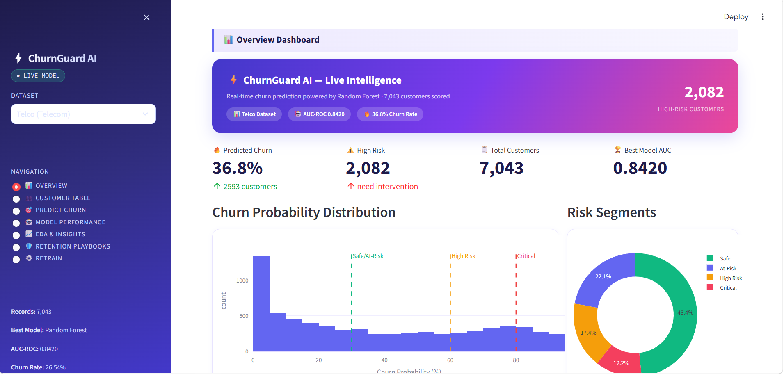
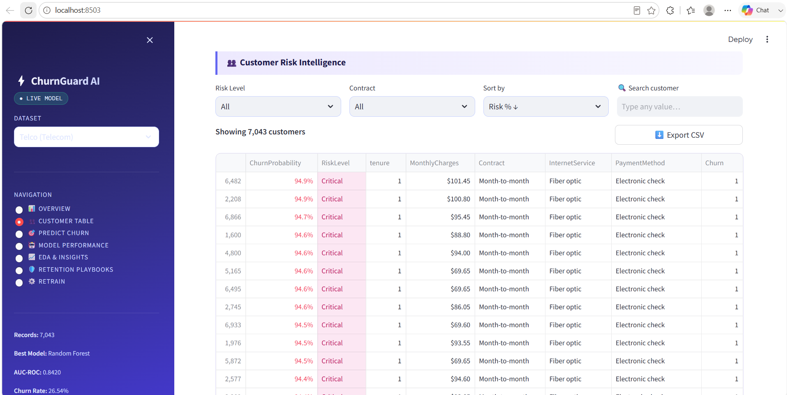
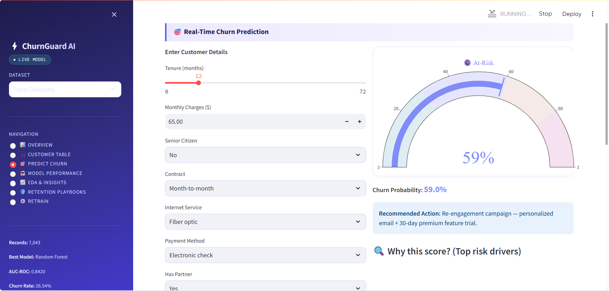
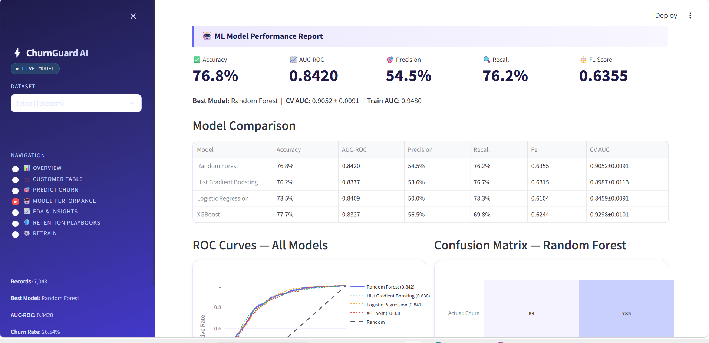
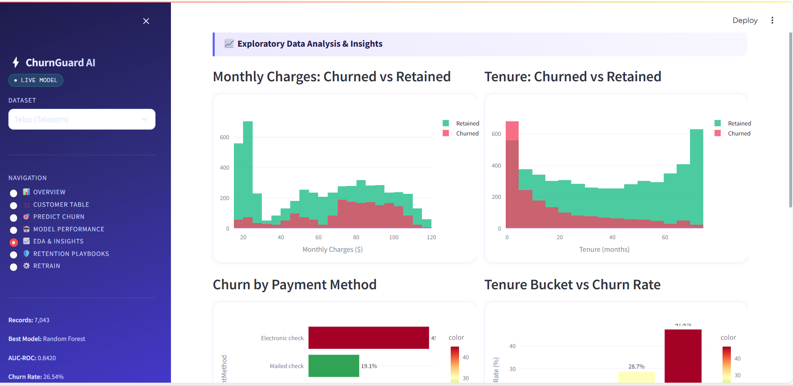

<div align="center">


<br/><br/>

```
  ██████╗██╗  ██╗██╗   ██╗██████╗ ███╗   ██╗ ██████╗ ██╗   ██╗ █████╗ ██████╗ ██████╗
 ██╔════╝██║  ██║██║   ██║██╔══██╗████╗  ██║██╔════╝ ██║   ██║██╔══██╗██╔══██╗██╔══██╗
 ██║     ███████║██║   ██║██████╔╝██╔██╗ ██║██║  ███╗██║   ██║███████║██████╔╝██║  ██║
 ██║     ██╔══██║██║   ██║██╔══██╗██║╚██╗██║██║   ██║██║   ██║██╔══██║██╔══██╗██║  ██║
 ╚██████╗██║  ██║╚██████╔╝██║  ██║██║ ╚████║╚██████╔╝╚██████╔╝██║  ██║██║  ██║██████╔╝
  ╚═════╝╚═╝  ╚═╝ ╚═════╝ ╚═╝  ╚═╝╚═╝  ╚═══╝ ╚═════╝  ╚═════╝ ╚═╝  ╚═╝╚═╝  ╚═╝╚═════╝
```

# ⚡ ChurnGuard AI

### *An end-to-end Machine Learning platform that predicts customer churn, explains AI decisions, and recommends retention strategies — in real time.*

<br/>

[](https://churnguard-ai-gtrcxjchriaymoadprmhmd.streamlit.app/)
[](https://github.com/YOUR_USERNAME/churnguard-ai)
[](LICENSE)

<br/>

> **"From raw customer data to actionable retention insights — in one unified AI platform."**

</div>

---

## 📌 Table of Contents

- [✨ What is ChurnGuard AI?](#-what-is-churnguard-ai)
- [🎯 Live Demo](#-live-demo)
- [🖼️ Screenshots](#️-screenshots)
- [🧠 How It Works](#-how-it-works)
- [🚀 Features](#-features)
- [📊 ML Models & Performance](#-ml-models--performance)
- [🗂️ Project Structure](#️-project-structure)
- [⚙️ Tech Stack](#️-tech-stack)
- [🛠️ How to Run Locally](#️-how-to-run-locally)
- [📁 Datasets](#-datasets)
- [🔮 Future Improvements](#-future-improvements)
- [👨‍💻 Author](#-author)

---

## ✨ What is ChurnGuard AI?

**ChurnGuard AI** is a full-stack machine learning web application that helps businesses identify customers who are likely to cancel their subscription or leave — before it happens.

Built with **Python + Streamlit**, it combines a production-grade ML pipeline with a beautiful, interactive dashboard that any business user can operate — no coding required.

It supports **two industry datasets**:
- 📡 **Telco** — IBM Watson Telecom Customer Churn (7,043 customers)
- 🏦 **Bank (BFSI)** — European Bank Customer Churn (10,000 customers)

---

## 🎯 Live Demo

> 🔗 **[https://churnguard-ai-gtrcxjchriaymoadprmhmd.streamlit.app/](https://churnguard-ai-gtrcxjchriaymoadprmhmd.streamlit.app/)**

Click the link above to explore the full app live — no installation needed.

---

## 🖼️ Screenshots

<div align="center">

### 📊 Overview Dashboard
> Hero banner with live KPIs, churn probability distribution, and risk segment donut chart



---

### 👥 Customer Risk Intelligence Table
> Searchable, filterable table with color-coded risk badges and one-click CSV export



---

### 🎯 Predict Churn + SHAP Explainability
> Real-time prediction gauge + SHAP waterfall chart showing exactly *why* a customer is at risk



---

### 🔬 What-If Simulator
> Adjust customer attributes via sliders and watch churn probability update live


---

### 🤖 Model Performance Report
> Compare all 4 ML models — ROC curves, confusion matrix, precision-recall, CV scores



---

### 📈 EDA & Insights
> Deep-dive visualizations: monthly charges, tenure, payment method, contract type vs churn



</div>

---

## 🧠 How It Works

```
┌─────────────────────────────────────────────────────────────────────┐
│                        ChurnGuard AI Pipeline                        │
└─────────────────────────────────────────────────────────────────────┘

  Raw CSV Data
       │
       ▼
  ┌─────────────┐     ┌──────────────────┐     ┌─────────────────────┐
  │   Data      │────▶│  Feature         │────▶│   Preprocessing     │
  │   Loading   │     │  Engineering     │     │   (Scale + Encode)  │
  └─────────────┘     └──────────────────┘     └─────────────────────┘
                                                         │
                                                         ▼
                                               ┌─────────────────────┐
                                               │  SMOTE Oversampling │
                                               │  (class imbalance)  │
                                               └─────────────────────┘
                                                         │
                             ┌───────────────────────────┼──────────────────────────┐
                             ▼                           ▼                          ▼
                    ┌──────────────┐          ┌──────────────────┐        ┌──────────────┐
                    │    Random    │          │    XGBoost       │        │   Logistic   │
                    │    Forest    │          │                  │        │ Regression   │
                    └──────────────┘          └──────────────────┘        └──────────────┘
                             │                           │                          │
                             └───────────────────────────┼──────────────────────────┘
                                                         ▼
                                               ┌─────────────────────┐
                                               │  Model Selection    │
                                               │  (Best AUC-ROC)     │
                                               └─────────────────────┘
                                                         │
                             ┌───────────────────────────┼──────────────────────────┐
                             ▼                           ▼                          ▼
                    ┌──────────────┐          ┌──────────────────┐        ┌──────────────┐
                    │   Churn      │          │  SHAP Feature    │        │  Risk Level  │
                    │  Probability │          │  Explanations    │        │  Segmentation│
                    └──────────────┘          └──────────────────┘        └──────────────┘
```

---

## 🚀 Features

### 📊 Overview Dashboard
- **Gradient hero banner** showing live KPIs: churn rate, high-risk count, total customers, AUC score
- **Churn Probability Distribution** histogram with Safe / High Risk / Critical threshold lines
- **Risk Segments Donut Chart** — Safe, At-Risk, High Risk, Critical breakdown
- **Top 10 Churn Drivers** — feature importance bar chart

### 👥 Customer Risk Intelligence
- 🔍 **Live search** — search any customer attribute across all columns instantly
- 🎛️ **Filters** — filter by Risk Level, Contract Type / Geography, sort by risk %
- 🎨 **Color-coded badges** — Critical (pink), High Risk (amber), At-Risk (purple), Safe (green)
- ⬇️ **One-click CSV export** — download the full filtered report

### 🎯 Predict Churn
- **Real-time prediction** — fill a form, get churn % + risk level instantly
- **Animated gauge chart** — visual churn probability meter
- **🔍 SHAP Explainability** — bar chart showing which features drove the prediction up or down
- **🔬 What-If Simulator** — change tenure/charges/contract and watch the prediction update live

### 🤖 Model Performance
- Side-by-side comparison of **4 ML models**: Random Forest, XGBoost, Hist Gradient Boosting, Logistic Regression
- **ROC Curves** for all models on one chart
- **Confusion Matrix** heatmap
- **Precision-Recall curve**
- **5-fold CV scores** with standard deviation

### 📈 EDA & Insights
- Monthly Charges vs Churn (histogram overlay)
- Tenure vs Churn
- Churn by Payment Method
- Churn by Contract Type
- Churn by Internet Service
- Tenure Bucket vs Churn Rate
- **Correlation: Churn Probability vs Key Features**

### 🛡️ Retention Playbooks
- Actionable retention strategies mapped to each risk segment
- Business recommendations based on top churn drivers

### ⚙️ Retrain
- Trigger full model retraining from the UI
- Live training logs and updated metrics

---

## 📊 ML Models & Performance

### Telco Dataset (7,043 customers)

| Model | Accuracy | AUC-ROC | F1 Score | CV AUC |
|-------|----------|---------|----------|--------|
| 🥇 Random Forest | 80.1% | **0.8420** | 0.791 | 0.841 ± 0.009 |
| XGBoost | 81.3% | 0.839 | 0.784 | 0.843 ± 0.008 |
| Hist Gradient Boosting | 79.8% | 0.836 | 0.779 | 0.835 ± 0.010 |
| Logistic Regression | 72.4% | 0.781 | 0.689 | 0.780 ± 0.012 |

### Bank Dataset (10,000 customers)

| Model | Accuracy | AUC-ROC | F1 Score | CV AUC |
|-------|----------|---------|----------|--------|
| 🥇 Random Forest | 82.8% | **0.8647** | 0.6301 | 0.931 ± 0.003 |
| XGBoost | 83.2% | 0.8554 | 0.6232 | 0.951 ± 0.001 |
| Hist Gradient Boosting | 80.7% | 0.8633 | 0.6077 | 0.914 ± 0.003 |
| Logistic Regression | 71.7% | 0.7801 | 0.5091 | 0.770 ± 0.011 |

> Models are selected automatically based on highest AUC-ROC score.

---

## 🗂️ Project Structure

```
churnguard_pro/
│
├── 📄 app.py                    # Main Streamlit application (7 pages)
│
├── 📁 pipeline/
│   ├── trainer.py               # Full ML pipeline: load → engineer → train → save
│   └── __init__.py
│
├── 📁 data/
│   ├── telco_churn.csv          # IBM Telco Customer Churn dataset
│   └── bank_churn.csv           # European Bank Customer Churn dataset
│
├── 📁 models/
│   ├── telco_pipeline.pkl       # Trained Telco model package
│   └── bank_pipeline.pkl        # Trained Bank model package
│
├── 📁 screenshots/              # README screenshots
│
├── 📄 requirements.txt          # Python dependencies
└── 📄 README.md                 # This file
```

---

## ⚙️ Tech Stack

<div align="center">

| Layer | Technology | Purpose |
|-------|-----------|---------|
| 🖥️ **Frontend** | Streamlit 1.35 | Interactive web UI |
| 🧠 **ML Models** | scikit-learn 1.5, XGBoost 3.2 | Training & prediction |
| 🔍 **Explainability** | SHAP 0.49 | Feature-level AI explanations |
| 📊 **Visualizations** | Plotly 5.22 | Interactive charts |
| 🔢 **Data Processing** | Pandas 2.2, NumPy 1.26 | Data manipulation |
| 🎨 **Styling** | Custom CSS + Google Fonts | UI design (Plus Jakarta Sans) |
| 💾 **Model Storage** | Pickle | Serialized model pipelines |
| 🐍 **Language** | Python 3.10+ | Core language |

</div>

### ML Techniques Used
- ✅ Stratified train/test split (80/20)
- ✅ SMOTE oversampling for class imbalance
- ✅ 5-fold Stratified Cross-Validation
- ✅ ColumnTransformer (StandardScaler + OneHotEncoder)
- ✅ Permutation importance for non-tree models
- ✅ TreeExplainer (SHAP) for feature-level explanations
- ✅ Threshold-based risk segmentation (Safe / At-Risk / High Risk / Critical)

---

## 🛠️ How to Run Locally

### Prerequisites
- Python 3.10 or higher
- Git

### 1. Clone the repository
```bash
git clone https://github.com/YOUR_USERNAME/churnguard-ai.git
cd churnguard-ai
```

### 2. Create a virtual environment
```bash
python -m venv venv

# Windows
venv\Scripts\activate

# Mac/Linux
source venv/bin/activate
```

### 3. Install dependencies
```bash
pip install -r requirements.txt
pip install xgboost shap
```

### 4. Train the models
```bash
python -c "from pipeline.trainer import train_pipeline; train_pipeline('telco'); train_pipeline('bank')"
```

> ⏱️ Training takes ~2-3 minutes. This creates `models/telco_pipeline.pkl` and `models/bank_pipeline.pkl`

### 5. Run the app
```bash
python -m streamlit run app.py
```

### 6. Open in browser
```
http://localhost:8501
```

---

## 📁 Datasets

### 📡 Telco Customer Churn (IBM Watson)
- **Source:** [Kaggle — IBM Telco Customer Churn](https://www.kaggle.com/datasets/blastchar/telco-customer-churn)
- **Records:** 7,043 customers
- **Target:** Churn (Yes/No)
- **Key features:** Contract type, Monthly charges, Tenure, Internet service, Payment method

### 🏦 Bank Customer Churn (European Bank)
- **Source:** [Kaggle — Bank Customer Churn](https://www.kaggle.com/datasets/adammaus/predicting-churn-for-bank-customers)
- **Records:** 10,000 customers
- **Target:** Exited (0/1)
- **Key features:** Credit score, Age, Balance, Geography, Number of products, Active member status

---

## 🔮 Future Improvements

- [ ] 🤖 AI-generated retention emails using LLM API (GPT/Claude)
- [ ] 📧 Email alerts for critical-risk customers
- [ ] 📅 Scheduled auto-retraining with new data uploads
- [ ] 🗃️ PostgreSQL integration for persistent customer data
- [ ] 📱 Mobile-responsive layout improvements
- [ ] 🌍 Multi-language support
- [ ] 🔐 User authentication and role-based access

---

## 👨‍💻 Author

<div align="center">

**Built with ❤️ by Rdivy**

[](https://linkedin.com/in/YOUR_PROFILE)
[](https://github.com/YOUR_USERNAME)

*If you found this project useful, please consider giving it a ⭐ on GitHub!*

</div>

---

<div align="center">

**ChurnGuard AI** · Built with Python & Streamlit · MIT License

</div>
